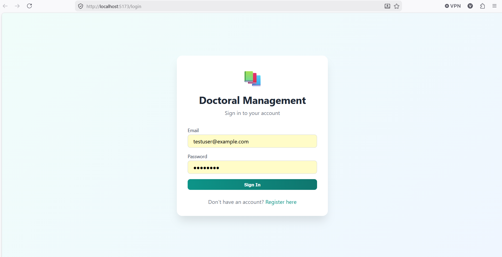
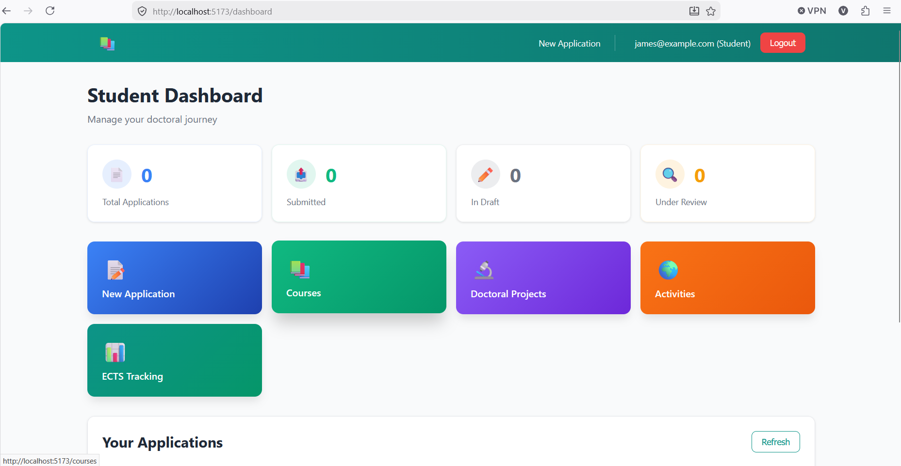
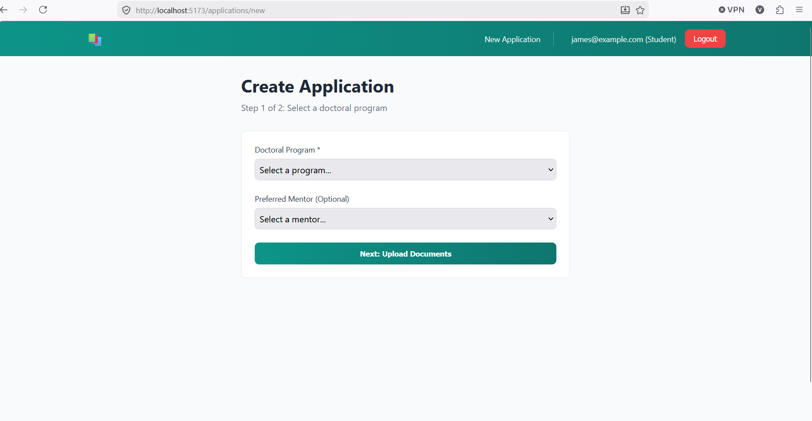
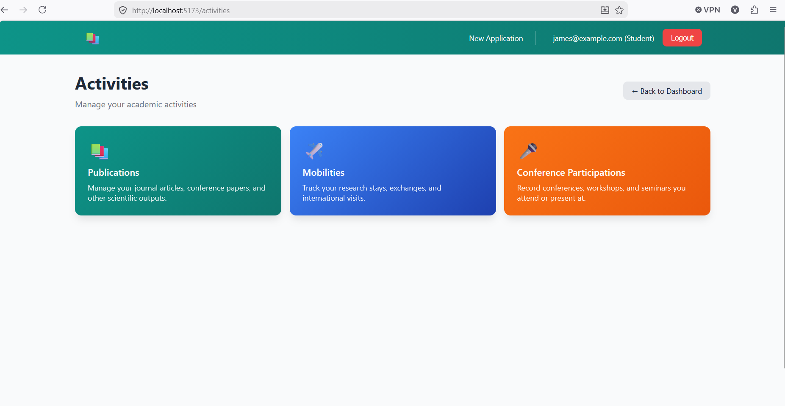
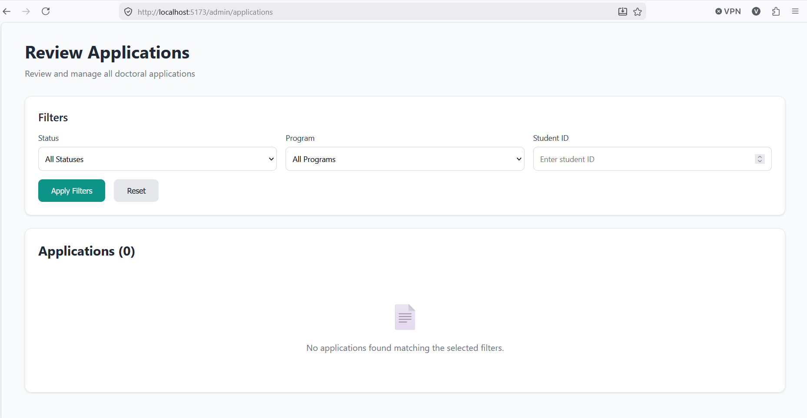

# DoctoralManagement

DoctoralManagement is a full-stack web application for managing doctoral study workflows. The system supports user authentication, role-based access, doctoral study applications, activity submission, and administrative review processes.

The project was developed as a thesis defense project and follows a layered backend architecture with a separate React frontend.

## Features

- User registration and login
- JWT authentication
- Role-based authorization
- Protected backend API endpoints
- Doctoral study application workflow
- Activity submission and tracking
- Administrative review functionality
- PostgreSQL database persistence
- Request validation
- Global exception handling
- React frontend
- Protected frontend routes
- API communication with Axios
- Token handling with JWT decoding
- Responsive user interface

> Note: Some workflow features may still be planned or partially implemented. See the Future Improvements section for planned enhancements.

## Tech Stack

### Backend

- ASP.NET Core
- Clean Architecture
- Entity Framework Core
- PostgreSQL
- JWT Authentication
- REST API
- Role-based Authorization
- Swagger
- Request Validation
- Global Exception Handling
- Fluent Validation

### Frontend

- React
- Vite
- JavaScript
- Axios
- React Router
- jwt-decode
- CSS / UI styling

## Screenshots

### Login



### Dashboard



### Doctoral Application



### Activities



### Admin Review



## How It Works

1. The user registers and logs in.
2. The backend returns a JWT token after successful login.
3. The frontend uses the token for authenticated API requests.
4. Users can submit doctoral study applications.
5. Users can submit and track doctoral study activities.
6. Admin or authorized users can review submitted data depending on their role.
7. Data is persisted in a PostgreSQL database.

## Project Structure

```text
DoctoralManagement/
  DoctoralManagement.API/
  DoctoralManagement.Application/
  DoctoralManagement.Domain/
  DoctoralManagement.Infrastructure/
  doctoral-frontend/
  screenshots/
  README.md
```

### Backend Structure

The backend follows Clean Architecture principles:

- `DoctoralManagement.API` — Controllers, API configuration, authentication setup, Swagger, request/response contracts
- `DoctoralManagement.Application` — Business logic, services, interfaces, validation, use case logic
- `DoctoralManagement.Domain` — Core domain models and business entities
- `DoctoralManagement.Infrastructure` — Database context, repositories, migrations, persistence logic

### Frontend Structure

The frontend is organized as a separate React application.

Common frontend responsibilities include:

- Pages for user interaction
- API communication with the backend
- Authentication token handling
- Protected routes
- Form handling and validation
- UI components

## Backend Setup

### Prerequisites

- .NET SDK matching the project target framework
- PostgreSQL
- Visual Studio or another IDE
- pgAdmin or another PostgreSQL management tool

### Check Required .NET Version

Open any `.csproj` file and check the target framework:

```xml
<TargetFramework>net8.0</TargetFramework>
```

Install the required .NET SDK if it is not already installed.

You can check installed SDKs with:

```bash
dotnet --list-sdks
```

### Configuration

This project uses local configuration for sensitive values such as database connection strings and JWT secrets.

Do not commit real passwords, connection strings, or secret keys to GitHub.

For local development, configure User Secrets from the API project folder:

```bash
cd DoctoralManagement.API
dotnet user-secrets init
```

Set the PostgreSQL connection string:

```bash
dotnet user-secrets set "ConnectionStrings:DefaultConnection" "Host=localhost;Port=5432;Database=DoctoralManagementDb;Username=postgres;Password=your_password"
```

Set JWT configuration:

```bash
dotnet user-secrets set "JwtSettings:Secret" "your-very-long-secret-key-at-least-32-characters"
dotnet user-secrets set "JwtSettings:Issuer" "DoctoralManagement"
dotnet user-secrets set "JwtSettings:Audience" "DoctoralManagementUsers"
```

You can check saved secrets with:

```bash
dotnet user-secrets list
```

### Database Setup

Create a PostgreSQL database in pgAdmin, for example:

```text
DoctoralManagementDb
```

Make sure the database name matches the database name in your connection string.

Then run database migrations.

Using Visual Studio Package Manager Console:

```powershell
Update-Database
```

Recommended Package Manager Console setup:

```text
Default project: DoctoralManagement.Infrastructure
Startup project: DoctoralManagement.API
```

Alternatively, using .NET CLI:

```bash
dotnet ef database update --project DoctoralManagement.Infrastructure --startup-project DoctoralManagement.API
```

### Run Backend

From the project root:

```bash
cd DoctoralManagement.API
dotnet run
```

Swagger should be available at a localhost URL similar to:

```text
https://localhost:7159/swagger
```

The exact port may be different depending on your local setup.

## Frontend Setup

Go to the frontend folder:

```bash
cd doctoral-frontend
```

Install dependencies:

```bash
npm install
```

Create a `.env` file if the frontend requires an API base URL:

```env
VITE_API_BASE_URL=https://localhost:7159/api
```

Make sure the port matches your backend API port.

Start the frontend:

```bash
npm run dev
```

The frontend will usually run at:

```text
http://localhost:5173
```

## Development Notes

This project was created as a thesis defense project and demonstrates a full-stack application with a structured backend and separate frontend.

The backend uses JWT authentication and role-based authorization to protect endpoints and separate user permissions.

The application uses PostgreSQL for persistence and Entity Framework Core for data access.

Sensitive local values are configured using .NET User Secrets.

## What I Learned

While building this project, I practiced:

- Building a full-stack application with ASP.NET Core and React
- Structuring a backend using Clean Architecture
- Implementing JWT authentication
- Implementing role-based authorization
- Working with PostgreSQL and Entity Framework Core
- Designing REST API endpoints
- Building a doctoral study workflow system
- Connecting a React frontend to an ASP.NET Core backend
- Managing protected routes and authenticated requests
- Handling validation and backend errors
- Organizing a larger thesis project into multiple layers

## Project Status

The project includes the main backend structure and core doctoral management workflow functionality.

Some frontend improvements and workflow enhancements may still be planned.

## Future Improvements

- Improve frontend UI and responsive design
- Add or complete mentor role workflow
- Add email notifications
- Add automated tests
- Improve admin/reviewer screens
- Deployment

## Author

Vladimir Gogovski

- GitHub: [Gogovski20](https://github.com/Gogovski20)
- LinkedIn: https://www.linkedin.com/in/vladimir-gogovski